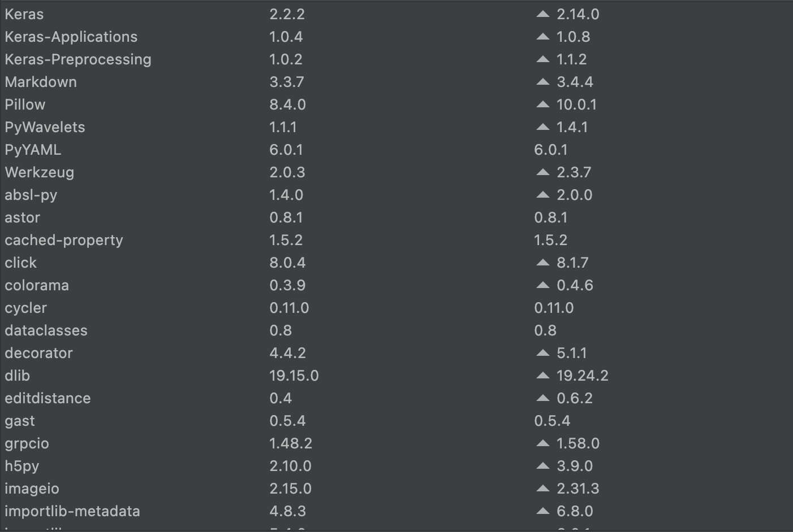
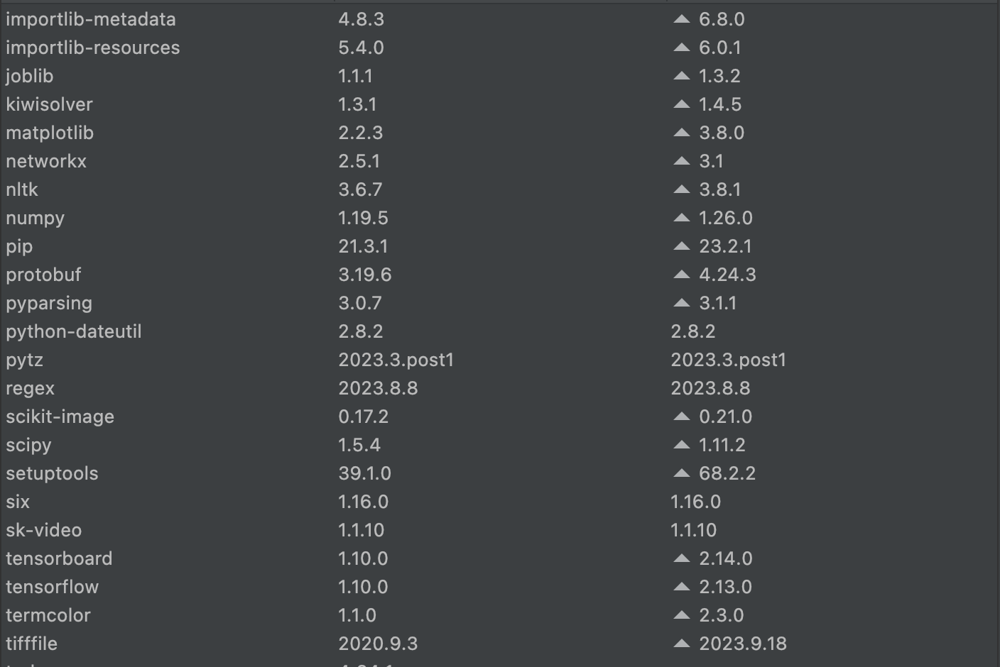
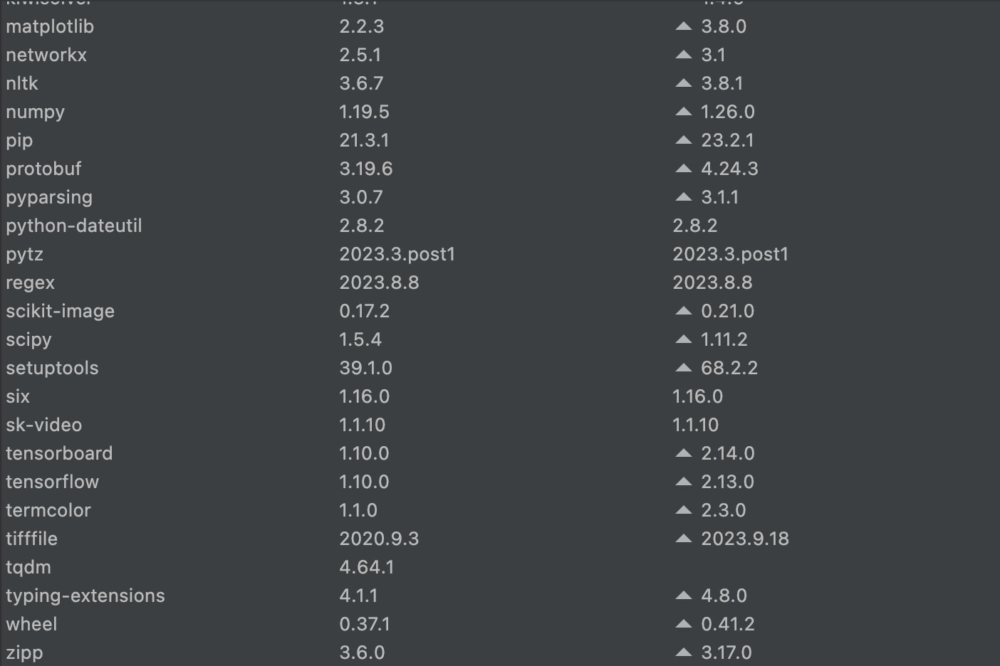

# OnlineKD-LipNetITA
This repository is dedicated to my Master's thesis project, in which I will implement online Knowledge Distillation (KD) on the LipNet model with an Italian dataset.

## Project Overview

**Online KD Implementation**: the primary goal of this project is to apply an Online Knowledge Distillation technique described in the paper "_Effective Online Knowledge Distillation via Attention-Based Model Ensembling_" by Diana-Laura Borza et al. [[1](https://www.mdpi.com/2227-7390/10/22/4285)].

**LipNet Implementation**: this project is based on the Keras implementation of the method described in the paper "_LipNet: End-to-End Sentence-level Lipreading_" by Yannis M. Assael et al. [[2](https://arxiv.org/abs/1611.01599)], implemented by [[3](https://github.com/rizkiarm/LipNet)].

**Reference**: this project use a previous implementation of LipNet with an Italian dataset [[4](https://github.com/BenedettoSimone/Lipnet-ITA)]. Please follow the instructions in this repository to use the new updated version of LipNet.

## Prerequisites
- Python 3.6.6

## 1. Getting started
In this section, we will first examine how to install and run the vanilla version of LipNet. Next, we will explore the version with Online KD.


### 1.1 Usage

To use the model, first you need to clone the repository:
```
https://github.com/BenedettoSimone/OnlineKD-LipNetITA
```

Then you can install the package (if you are using an IDE, you can skip this step):
```
cd OnlineKD-LipNetITA/
pip install -e .
```


Next, install the requirements:

```
pip install -r requirements.txt
```
<br>

If you have some issue, please follow the list of requirements showed in the following images:

<p align="center"></p>
<p align="center"></p>
<p align="center"></p>